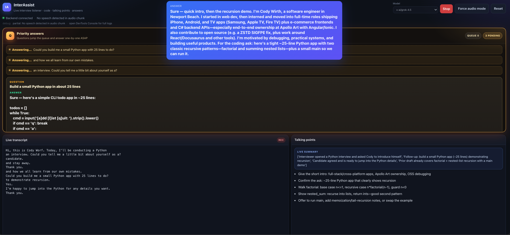

<div align="center">
  <h1>InterAssist</h1>
  <p><strong>A focused, local interview copilot for speech, answers, talking points, and code.</strong></p>
  <p>
    <code>React</code>
    <code>FastAPI</code>
    <code>WebSocket</code>
    <code>OpenRouter</code>
  </p>
</div>

<p align="center">
  
</p>

InterAssist listens to an interview through the browser microphone and turns the conversation into four useful surfaces:

- **Live transcript** — the latest recognized speech, without waiting for the slower analysis panels.
- **Priority answers** — direct questions jump ahead and receive a concise answer.
- **Talking points** — personalized suggestions for what to say next.
- **Code draft** — a working draft that evolves when the conversation becomes technical.

The app is designed for local use. It does not use a database or permanently store interview session state.

## Quick start

### 1. Get an OpenRouter API key

Create an API key at [openrouter.ai/keys](https://openrouter.ai/keys). The key is required before starting the app because OpenRouter handles both chat analysis and fallback audio transcription.

### 2. Create the environment file

From the repository root:

```bash
cp back/.env.example back/.env
```

Open `back/.env` and replace the placeholder with your key:

```env
OPENROUTER_API_KEY=replace_with_your_openrouter_key
```

Keep this value private. `back/.env` is ignored by Git and must never be committed.

### 3. Start the application

Run the launcher from the repository root:

```bash
bash start.sh
```

The launcher:

1. Selects a compatible Python interpreter.
2. Creates or reuses `back/.venv`.
3. Installs backend dependencies.
4. Installs frontend dependencies.
5. Starts FastAPI and the React development server.
6. Waits for the backend health check before reporting the app ready.

Open [http://127.0.0.1:5173](http://127.0.0.1:5173) in your browser and allow microphone access. Press **Ctrl+C** in the launcher terminal to stop both services.

## Configuration

The complete template is in `back/.env.example`. The most useful settings are:

```env
OPENROUTER_API_KEY=replace_with_your_openrouter_key
OPENROUTER_BASE_URL=https://openrouter.ai/api/v1
OPENROUTER_MODEL=x-ai/grok-4.5
OPENROUTER_STT_MODEL=openai/whisper-1
```

`OPENROUTER_MODEL` controls the analysis and answer model. The model can also be changed from the UI before listening starts.

### Optional OpenAI Realtime mode

If you also have an OpenAI API key, add it to `back/.env`:

```env
OPENAI_API_KEY=replace_with_your_openai_key
OPENAI_REALTIME_MODEL=gpt-live-transcribe
```

With this key, the browser can use OpenAI Realtime WebRTC transcription. Without it, InterAssist automatically uses the OpenRouter-only fallback and does not make a failing Realtime request. An OpenRouter key cannot authenticate against OpenAI's Realtime transport.

## What happens when you listen

1. Select a model if needed and click **Start listening**.
2. The browser captures microphone audio over a secure local context (`localhost` or `127.0.0.1`).
3. With OpenAI Realtime configured, completed speech turns arrive through WebRTC with low latency.
4. In OpenRouter-only mode, the browser sends short complete audio clips to OpenRouter Whisper. Each recognized line is displayed as soon as STT returns.
5. The backend sends the newest conversation context to the selected OpenRouter model for structured panel updates.
6. Questions are routed to a separate fast-answer path so they do not wait behind the full code and talking-point analysis.

OpenRouter's public audio API is file-based rather than token-streaming. OpenRouter-only mode is therefore near-live, not word-by-word streaming; network and transcription time determine the exact delay.

You can type or paste a line into the transcript input when microphone access is unavailable. **Force audio mode** starts the OpenRouter transcription path directly.

## Project layout

```text
interassist/
├── back/
│   ├── main.py             FastAPI app, WebSocket, OpenRouter clients
│   ├── requirements.txt    Python dependencies
│   ├── profile_context.txt Candidate context used for personalized answers
│   └── .env.example        Safe environment template
├── front/
│   ├── src/App.jsx         React interface and microphone lifecycle
│   └── package.json        Frontend scripts and dependencies
├── docs/
│   └── interassist-overview.png
└── start.sh                Local development launcher
```

## Useful URLs

| Service | URL |
| --- | --- |
| Web interface | [http://127.0.0.1:5173](http://127.0.0.1:5173) |
| Backend health | [http://127.0.0.1:8000/api/health](http://127.0.0.1:8000/api/health) |
| Backend config | [http://127.0.0.1:8000/api/config](http://127.0.0.1:8000/api/config) |

## Logs and troubleshooting

The launcher writes:

- `.run/back.log` — FastAPI and WebSocket activity.
- `.run/front.log` — Vite output.
- `logs/YYYY-MM-DD.log` — combined daily activity.

If the browser cannot connect:

1. Confirm `bash start.sh` is still running.
2. Check [the health endpoint](http://127.0.0.1:8000/api/health).
3. Confirm ports `8000` and `5173` are available.
4. Refresh the browser after a frontend restart.

If the microphone does not start:

- Use `http://127.0.0.1:5173` or `http://localhost:5173`, not an arbitrary insecure origin.
- Grant microphone permission to the browser.
- Use **Force audio mode** to bypass browser speech or Realtime probing.
- Check the browser DevTools console and `.run/back.log`.

## Development checks

```bash
cd front
npm run build

cd ../back
python -m py_compile main.py
```

## Optional profile context

`back/profile_context.txt` is the candidate context used by the assistant. It contains the candidate's identity, work history, public projects, and interview-answer preferences. The backend loads it once for each WebSocket interview session and also uses it for direct `/api/analyze` requests. The bounded file is sent only as model context and is never sent to the browser.

To use InterAssist for another candidate, replace the contents of `back/profile_context.txt` with that candidate's reviewed facts and preferences, then restart the backend. Keep the file limited to information the candidate has authorized for model use; the application does not fetch remote profile URLs.

## Privacy and key handling

- API keys stay in `back/.env` and are never sent to the browser.
- Interview session state is held in memory for the active WebSocket.
- Local launcher logs may contain transcript and diagnostic data; remove them if the interview is sensitive.
